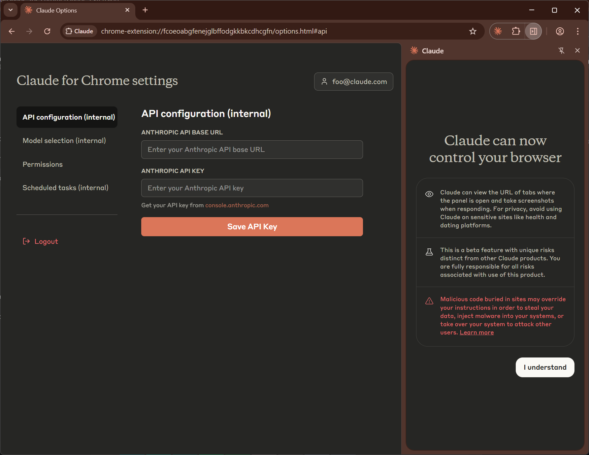
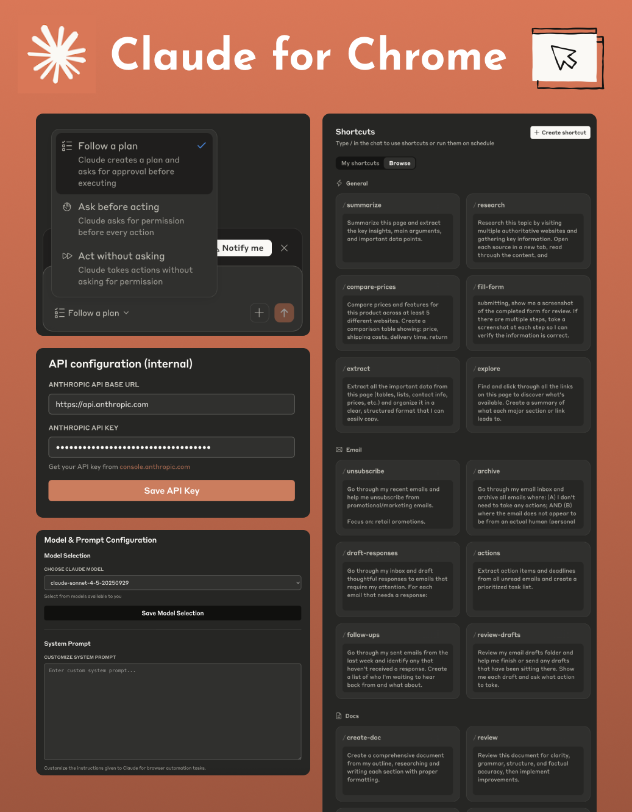
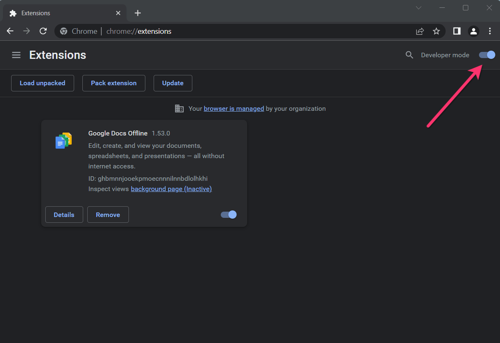
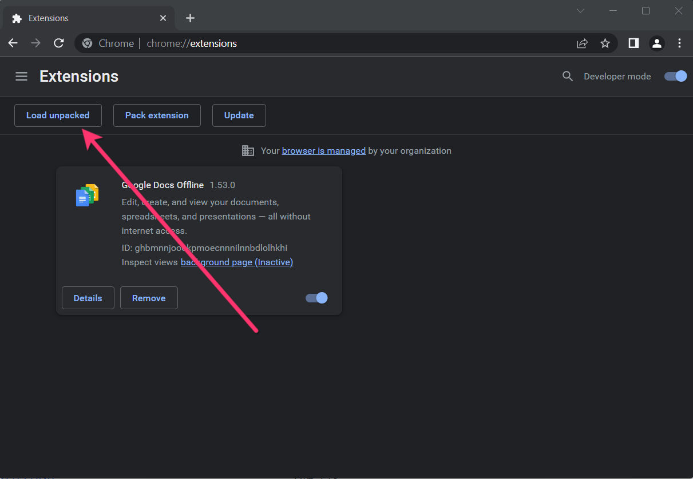

# Claude for Chrome (Research Preview) / Invitation Code - v1.0.34 Powered by Opus 4.5

<a href="/README.md">English</a> |
<a href="/README_ja.md">日本語</a> |
<a href="/README_zh.md">中文</a>

> [This is **not an official repository**. Please see the disclaimer for more information.](./guide/disclaimer.md)

This is an unlocked research preview of the **Claude for Chrome** extension. No Claude account or waitlist is required. Simply use your own API key to get instant access.

🛒&nbsp;&nbsp;<a href="https://payhip.com/b/xpZGB" target="_blank"><b>Purchase Now</b></a>
&nbsp;&nbsp;&nbsp;&nbsp;|&nbsp;&nbsp;&nbsp;&nbsp;
🚀&nbsp;&nbsp;<a href="https://cfc.aroic.workers.dev/download" target="_blank"><b>Download</b></a>

  
  &nbsp;&nbsp;
  

https://github.com/user-attachments/assets/5fa41682-9960-4b6e-b73d-5958167ac4b2

## 🚀 Installation Guide

Follow these simple steps to install the extension.

1. ### Download and Unzip

   Download the .zip file and unzip it to a folder on your computer.

2. ### Open Chrome Extensions

   In your Chrome browser, navigate to the extensions page by entering `chrome://extensions` in the address bar.

3. ### Enable Developer mode.
   
4. ### Click on the Load Unpacked button
   
5. ### Select the directory of with the unpacked Zoom Chrome Extension ZIP file from step 1

## ⚙️ Getting Started

### How to configure the API Base URL and API Key?

1. Right-click the Claude extension icon and click the Options menu to enter the Options page.

2. On the Options page, click API configuration (internal), and then enter your API Key in the input box below Anthropic API Key.

3. If you need to configure a third-party API Key, you will need to configure the API Base URL. Log in to https://cfc.aroic.workers.dev/ and configure it in the input box below Base URL. In some versions, this can be configured on the extension's Options page.

You're all set! Enjoy using Claude directly in Chrome.

## 📚 Disclaimer

**This repository is for educational and research purposes only.** All code is copyrighted by Anthropic Inc.

The source code was obtained from publicly accessible resources through browser developer tools.

If there are any copyright concerns, please contact for removal.
